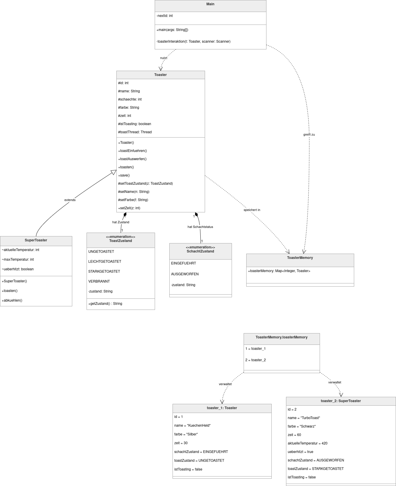

# TheFlyingToaster - Dokumentation

Eine Java-basierte Toaster-Simulation zur Demonstration von asynchroner Prozesssteuerung und objektorientierter Programmierung.

## 1. Systemarchitektur  

Das Projekt ist als zustandsgesteuerte Konsolenanwendung implementiert. Es nutzt eine asynchrone Architektur, um physische Hardware-Vorgänge (Heizvorgänge, Abkühlphasen) zu simulieren, ohne den Haupt-Thread der Benutzerinteraktion zu blockieren.  

### Klassenhierarchie und OOP-Prinzipien
 
- **Vererbung:** SuperToaster erweitert Toaster um eine thermische Logik.  
- **Polymorphie:** Die Steuerung in Main agiert primär auf Referenzen des Typs Toaster, was den transparenten Einsatz beider Modellvarianten ermöglicht.  
- **Kapselung:** Zustandsübergänge werden über dedizierte Methoden (toastEinfuehren, toastAuswerfen) gesteuert.  

## 2 . Nebenläufigkeits-Modell

Das System nutzt Multithreading zur Simulation von Zeitabläufen:  

- **Toast-Zyklus:** Ein dedizierter Thread verarbeitet den Fortschrittsbalken der Bräunung. Die Abbruchlogik ist über thread.interrupt() realisiert, um eine saubere Ressourcenfreigabe beim manuellen Auswurf zu gewährleisten.  

- **Hintergrund-Prozesse:** Der SuperToaster initiiert bei Überhitzung einen autonomen Abkühl-Thread, der den Instanz-Zustand (ueberhitzt) überwacht und bei Unterschreitung eines Schwellenwerts reaktiviert.  

## 3. Zustandsverwaltung

Die Zustände werden über typsichere Enumerationen abgebildet:  

- **SchachtZustand**: EINGEFUEHRT | AUSGEWORFEN (Mechanischer Status)  

- **ToastZustand**: UNGETOASTET | LEICHTGETOASTET | STARKGETOASTET | VERBRANNT (Qualitativer Status)  

Der Bräunungsgrad erhöht sich im Toaster-Thread inkrementell alle 15 Simulationssekunden, basierend auf der Ordinalzahl der Enum-Werte.  

## 4. Datenhaltung

Das Projekt verzichtet auf eine externe Datenbank und implementiert stattdessen einen in Memoryspeicher:  

- **ToasterMemory**: Hält eine statische HashMap<Integer, Toaster>. Dies ermöglichtschnellen Zugriff auf Instanzen über die eindeutige ID.  

## 5. Implementierungsdetails der Komponenten
| | |  
|-|-| 
| **Klasse** | **Kernfunktion** | **Wichtigste Zustandsänderung** |  
| Toaster | Basis-Logik, Thread-Management für den Timer, Zustandssteuerung. | AUSGEWORFEN -> EINGEFUEHRT  | 
| SuperToaster | Erweiterung um thermische Variablen (aktuelleTemperatur), Grenzwerterkennung und automatische Recovery-Logik. | ueberhitzt = true blockiert toasten() | 
| Main | CLI-Frontend, Event-Loop und Dispatching von Benutzerbefehlen. |   |


## 6. Installation & Ausführung

   1. Repository klonen:
	```
      git clone https://github.com/dein-username/theFlyingToaster.git
	```
   2. Kompilieren:
	```
       javac src/*.java -d out/
	```       
   3. Ausführen:
	```
       java -cp out Main
	```
## 7. Klassen- und Objektdiagramm



## 8. Bekannte Herausforderungen & Limitierungen

**Console Scrambling (Asynchrone Interruption)**

Da der Toastvorgang und die Abkühlphase in Hintergrund-Threads laufen, kommunizieren diese autonom über System.out.println() mit dem Benutzer. Dies führt in einer Konsolenanwendung zu folgenden Problemen:

    Überlagerung: Während der Benutzer im Hauptmenü eine Eingabe tätigt (z. B. eine ID eintippt), kann ein Thread eine Statusmeldung (z. B. „[Status] leicht getoastet“) ausgeben. Dies zerreißt die visuelle Menüstruktur.

    Input-Verschlucken: Die Statusmeldungen können den Prompt für die Benutzereingabe nach oben verschieben, sodass der Cursor scheinbar „im Leeren“ steht, obwohl der Scanner weiterhin auf Input wartet.


   
